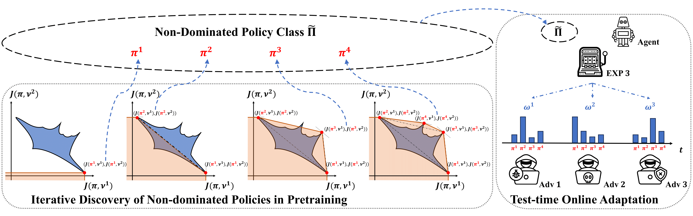

<p align="center">

  <h1 align="center">Beyond Worst-case Attacks: Robust RL with Adaptive Defense via Non-dominated Policies</h1>
  <h3 align="center">ICLR 2024 <a href="https://openreview.net/forum?id=DFTHW0MyiW">spotlight</a></h3>
  
  <p align="center">
    <a><strong>Xiangyu Liu*</strong></a>
    ·
    <a><strong>Chenghao Deng*</strong></a>
    ·
    <a><strong>Yanchao Sun</strong></a>
    ·
    <a><strong>Yongyuan Liang</strong></a>
    ·
    <a><strong>Furong Huang</strong></a>
  </p>

</p>

<h3 align="center">
  <a href="https://arxiv.org/abs/2402.12673"><strong>[Paper]</strong></a>
  ·
   <a href="https://protected-beyond-worst-case.github.io/home/"><strong>[Project page]</strong></a>
  ·
  <a href="https://x.com/furongh/status/1760859987851591681?s=46&t=iqTO3UQ6d96jwD4sbq_dcA"><strong>[X (Twitter)]</strong></a>

</h3>

<div align="center">
  
</div>


The codebase contains a reference implementation for PROTECTED, including iterative discovery of non-dominated polcies in pre-training and test-time online adaptation. Our code is based on [PA-AD](https://github.com/umd-huang-lab/paad_adv_rl.git) (Sun et al. 2022) codebase.


## Installation

First, please install [Anaconda](https://docs.anaconda.com/anaconda/install/) and set up a virtual environment  (suggested python version: 3.7.16).

Then, please run the following command to install required packages
```
# requirements
pip install -r requirements.txt

# need auto_LiRPA (Kaidi Xu, et al. 2020)
git clone https://github.com/KaidiXu/auto_LiRPA
cd auto_LiRPA
python setup.py install
```

## Iterative Discovery of Non-dominated Policies in Pre-training

To iteratively discover non-dominated policies in pre-training, use the following command:

```
python run.py --config-path configs/config_${env_name}.json --ref-model-list models/victims/${env_name}/model_0 --load-env models/victims/${env_name}/model_0
```
- ``env_name`` can be ``hopper``, ``walker``, ``halfcheetah`` or ``ant``.
- ``--ref-model-list`` is not necessaily to be only one checkpoint if more than one pre-trained model is used.
- Please make sure ``--load-env`` is consistent with some checkpoint in ``--ref-model-list``. 

The results will be saved in ``vanilla_ppo_${env_name}/agents/YOUR_EXP_ID``, where ``YOUR_EXP_ID`` is a randomly generated experiment ID. You can extract the best model in each iteration from this folder by running:

```
python get_best_pickle.py protected_ant/agents/YOUR_EXP_ID
```
which will generate ``model_0``, ``model_1``, ..., ``model_{N-1}`` for ``N`` iterations.  

## Evaluation under Various Attack Scenarios
To evaluate the performance of non-dominated policies against no attacks or heurisitc attacks, random and RS (Zhang et al. 2020), use the following command
```
python test.py --config-path configs/config_${env_name}.json --deterministic --attack-method ${attack_name} \
    --ref-model-list models/victims/${env_name}/model_0 models/victims/${env_name}/model_1 models/victims/${env_name}/model_2 \
        models/victims/${env_name}/model_3 models/victims/${env_name}/model_4 models/victims/${env_name}/model_5 models/victims/${env_name}/model_6 \
    --results-log logs/test_${env_name}_${attack_name}.log
```
- For ``attack_name``, use ``none`` for natural performance, ``random`` for random perturbations and ``sarsa`` for robust SARSA (RS).
- The result will be recorded in ``logs/test_${env_name}_${attack_name}.log``. 

To evaluate the performance against trained adverasries, SA-RL (Zhang et al. 2020)and PA-AD (Sun et al. 2021), you can directly load a trained adversary or train a new one using the following command:
```
python run.py --config-path configs/config_${env_name}.json --mode ${adv_train} --iteration 1 --attack-multiple-victims --no-load-adv-policy --ppo-lr-adam 0.0
    --ref-model-list models/victims/${env_name}/model_0 models/victims/${env_name}/model_1 models/victims/${env_name}/model_2 \
        models/victims/${env_name}/model_3 models/victims/${env_name}/model_4 models/victims/${env_name}/model_5 models/victims/${env_name}/model_6
```
- For ``adv_train``, use ``adv-ppo`` for SA-RL and ``adv-pa-ppo`` for PA-AD. 
-  The results will be saved in ``vanilla_ppo_${env_name}/agents/YOUR_EXP_ID``, where ``YOUR_EXP_ID`` is a randomly generated experiment ID. You can extract the best model with the aforemnetioned command generating ``model_0``.

Use the following command to get the performance against trained adversaries:
```
python test.py --config-path configs/config_${env_name}.json --deterministic --attack-method ${adv_test} --attack-advpolicy-network models/attackers/${env_name}/${adv_model_name} \
    --ref-model-list models/victims/${env_name}/model_0 models/victims/${env_name}/model_1 models/victims/${env_name}/model_2 \
        models/victims/${env_name}/model_3 models/victims/${env_name}/model_4 models/victims/${env_name}/model_5 models/victims/${env_name}/model_6 \
    --results-log logs/test_${env_name}_${adv_name}.log
    
```
- For ``adv_test``, use ``advpolicy`` for SA-RL and ``paadvpolicy`` for PA-AD. 
- The result will be recorded in ``logs/test_${env_name}_${adv_name}.log``. 

## Test-time Online Adaptation

Use the following command for periodic attacks
```
python dynamic_attack.py --config-path configs/config_ant.json --deterministic --attack-method paadvpolicy --attack-advpolicy-network models/attackers/${env_name}/paad --switch-type period --switch-interval 100 \
    --ref-model-list models/victims/${env_name}/model_0 models/victims/${env_name}/model_1 models/victims/${env_name}/model_2 \
        models/victims/${env_name}/model_3 models/victims/${env_name}/model_4 models/victims/${env_name}/model_5 models/victims/${env_name}/model_6 \
    --results-log logs/${env_name}_period
```
and the result will be recorded in ``logs/ant_period_weight.csv``.

Use the following command for problisitic attacks
```
python dynamic_attack.py --config-path configs/config_ant.json --deterministic --attack-method paadvpolicy --attack-advpolicy-network models/attackers/${env_name}/paad --switch-type prob --switch-interval 0.1 \
    --ref-model-list models/victims/${env_name}/model_0 models/victims/${env_name}/model_1 models/victims/${env_name}/model_2 \
        models/victims/${env_name}/model_3 models/victims/${env_name}/model_4 models/victims/${env_name}/model_5 models/victims/${env_name}/model_6 \
    --results-log logs/${env_name}_prob
```
and the result will be recorded in ``logs/ant_prob_weight.csv``.


## Acknowlegements

This project is based on the following open-source projects. We thank the authors for releasing the source code.

- Zhang, Huan, et al. "Robust deep reinforcement learning against adversarial perturbations on state observations." Advances in Neural Information Processing Systems 33 (2020): 21024-21037.

- Xu, Kaidi, et al. "Automatic perturbation analysis for scalable certified robustness and beyond." Advances in Neural Information Processing Systems 33 (2020): 1129-1141.

- Zhang, Huan, et al. "Robust Reinforcement Learning on State Observations with Learned Optimal Adversary." International Conference on Learning Representations. 2020.

- Sun, Yanchao, et al. "Who Is the Strongest Enemy? Towards Optimal and Efficient Evasion Attacks in Deep RL." The Tenth International Conference on Learning Representations (ICLR 2022). 2022.

## Citing

Please cite our work if you find it is helpful:
```
@inproceedings{liu2023beyond,
  title={Beyond Worst-case Attacks: Robust RL with Adaptive Defense via Non-dominated Policies},
  author={Liu, Xiangyu and Deng, Chenghao and Sun, Yanchao and Liang, Yongyuan and Huang, Furong},
  booktitle={The Twelfth International Conference on Learning Representations},
  year={2023}
}
```